# Design Decision
The design pattern closely resembles strategy pattern implemented uing template leveraging compile time polymorphism. In this, the **MatrixPrice** which is a simulator takes in the instance of **EuropeanOption** or **AmericanOption** and executed the simulation.

Using templates instead of abstract base class with virtual functions led to
1. Early error detection
2. Faster execution as method is known before the program runs

The business logic ex. **Price()** to compute option price using exact method is encapsulated within the respective option classes. The MatrixPrices uses the interface of respective class to compute the price by providing arguments. This offers context flexibility ex. the same instance of the MatrixPricer is used to run different simulations for options of batch-1 to batch-4

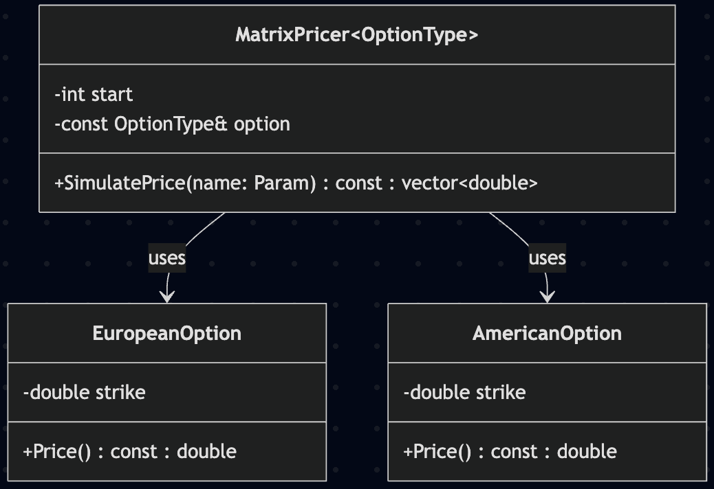
# Section A : Price
## a and b
### Question
#### a
Implement  the  above  formulae  for  call  and  put  option pricing  using  the  data  sets Batch 1  to Batch  4.  Check your  answers,  as  you  will  need  them  when  we  discuss  numerical  methods  for  option pricing.

#### b
Apply the put-call parity relationship to compute call and put option prices. For example, given the call price, compute the put price based on this formula using Batches 1 to 4. Check your answers  with the prices from part a. Note that there are two useful ways to implement parity: As a mechanism to calculate the call (or put) price  for  a  corresponding  put  (or  call)  price,  or  as  a  mechanism  to  check  if  a  given  set  of  put/call  prices satisfy parity. The ideal submission will neatly implement both approaches.

### Output
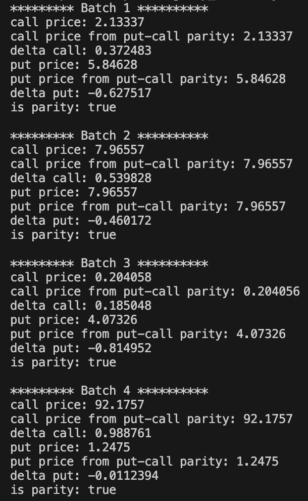

## c
### Question
Say  we  wish  to  compute  option  prices  for  a  monotonically  increasing  range  of  underlying values  of  S,  for example  10,  11,  12,  ...,  50.  To  this  end,  the  output  will  be  a  vector. This  entails calling  the  option  pricing formulae  for  each  value  S  and  each  computed  option  price  will  be  stored in  a  std::vector<double> object. It will be useful to write a global function that produces a  mesh array  of doubles separated by a mesh size h. 

### Output
The simulation is executed by varying spot price of the underlying stock from 60 to 65 of step 1
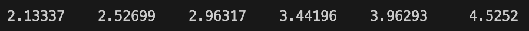

## d
### Question
Now we wish to extend part c and compute option prices as a function of i) expiry time, ii) volatility, or iii) any of the option pricing parameters.  Essentially, the  purpose  here  is to be  able to input  a  matrix  (vector of vectors) of option parameters and receive a matrix of option prices as the result. Encapsulate this functionality in the most flexible/robust way you can think of. 

### Output
The simulation is executed by varying spot price of the underlying stock and strike price from 60 to 65 of step 1
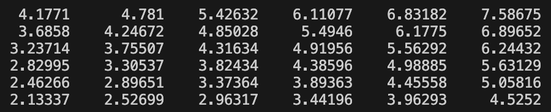

# Section A : Greeks
## a
### Question
Implement the above  formulae  for  gamma  for  call  and  put future option pricing  using the  data  set: K =  100, S = 105, T = 0.5, r = 0.1, b = 0 and sig = 0.36. (exact delta call = 0.5946, delta put = -0.3566).

### Output
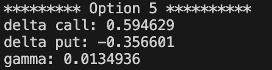

## b
### Question

### Output
We  now  use  the  code  in  part  a  to  compute  call  delta  price  for  a  monotonically  increasing  range  of underlying values of S,  for  example  10,  11, 12,  ..., 50. To  this end,  the  output  will be  a  vector and  it entails calling the above  formula for  a call delta  for each value S and each computed option price  will be store in a std::vector<double> object.  It  will  be  useful  to  reuse the above  global  function  that  produces  a  mesh array of double separated by a mesh size h.

### Output
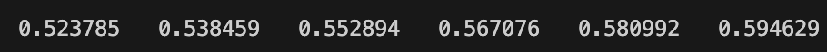

## c
### Question
Incorporate this into your above matrix pricer code, so you can input a matrix of option parameters and receive  a matrix of either Delta or Gamma as the result.  

### Output
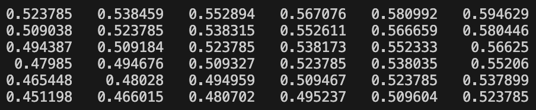

## d
### Question 
The  objective  of  this  part  is  to  perform  the  same  calculations  as  in  parts  a  and  b,  but  now  using  divided differences.  Compare  the  accuracy  with  various  values  of  the  parameter  h  (In  general,  smaller  values  of  h produce  better  approximations  but  we  need  to  avoid  round-offer  errors  and  subtraction  of  quantities  that  are very close to each other). Incorporate this into your well-designed class structure. From the below result, we can comclude that as divisor (h) becomes smaller and smaller, the approximations converges to exact solution.

### Output
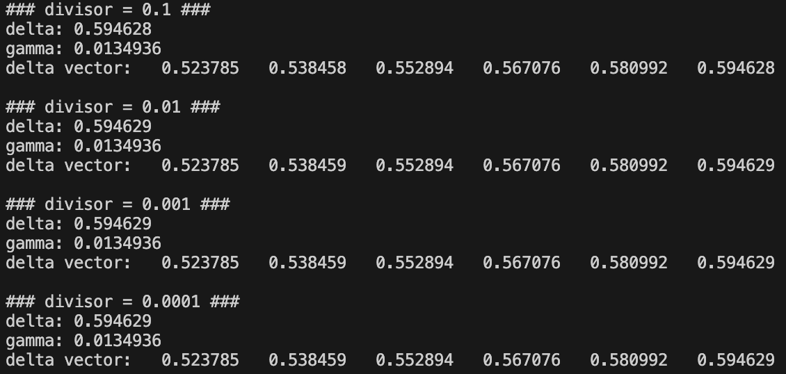

# Section B
## a and b
### Question
#### a
Program  the  above  formulae, and incorporate into your well-designed options pricing classes

#### b
Test the data with K = 100, sig = 0.1, r = 0.1, b = 0.02, S = 110 (check C = 18.5035, P = 3.03106). 

### Output
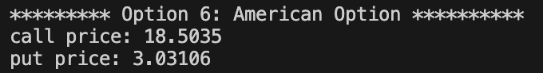

## c
### Question
We now use the code in part a) to compute call and put option price for a monotonically increasing range of  underlying  values of  S,  for  example  10,  11,  12,  ...,  50.  To  this  end,  the  output  will  be  a  vector  and  this exercise  entails calling  the  option  pricing  formulae  in  part  a)  for  each  value  S  and  each  computed  option price  will  be  stored in  a  std::vector<double> object.  It  will  be  useful  to  reuse  the  above  global function  that  produces  a  mesh  array of  double separated by a mesh size h.

### Output
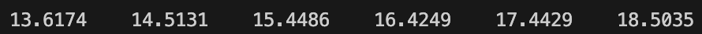

## d
### Question
Incorporate  this  into  your  above  matrix  pricer  code,  so  you  can  input  a  matrix  of  option  parameters  and receive a matrix of Perpetual American option prices.

### Output
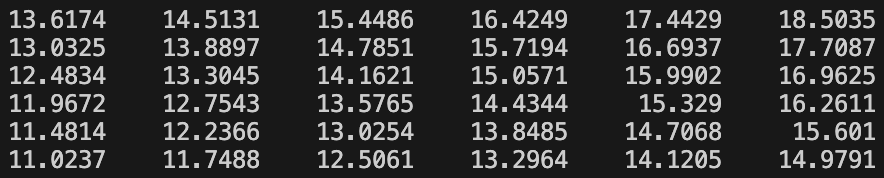

