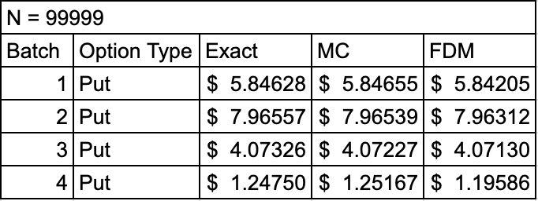
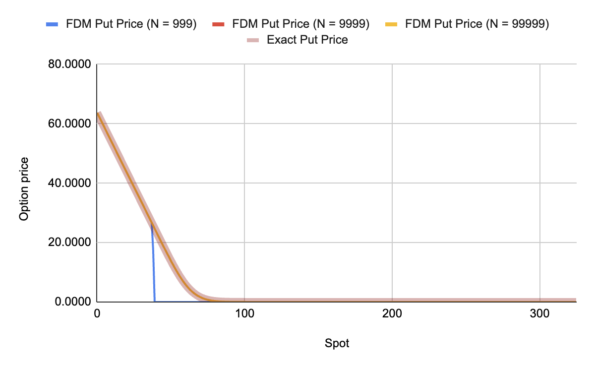

# Code explanation
To compute the price of the option using finite differance method, descritization of black-scholes PDE 

$$∂V/∂t + (0.5σ^2)∂^2V/∂S^2 +(rS)∂V/∂S - rV = 0$$

- σ: Volitality
- r: Risk-free rate

## Range
To descritize the above equation, explicit Euler method is employed from [0,T] and [0, S], where T is time to maturity and S is spot price of the underlying stock.

The PDE is descritised on both time(T) and space(S) to numerically approximate the option price V(S,t).

This is achievend by xarr memeber function in **Mesher.hpp** 
```
		std::vector<double> xarr(int J)
		{
			// NB Full array (includes end points)

			double h = (b - a) / double (J);
			
			int size = J+1;
			int start = 1;

			std::vector<double> result(size, start);
			result[0] = a;

			for (unsigned int j = 1; j < result.size(); j++)
			{
				result[j] = result[j-1] + h;
			}

			return result;
		}
```
## Initial and boundary condition


### Initial condition
V(S,t) of the option at maturity is equal to the payoff of the option at maturity ie.
1. V(S,t) = max(S - K, 0), Boundary condition for call option
2. V(S,t) = max(K - S, 0), Boundary condition for put option

The solution to the BS-PDE with boundary condition 1,is BS value of call option. Similarly, the solution to the BS-PDE with boundary condition 2, is the BS value of the put option.

### Boundary condition
- Put option : $V(0,t) = Ke^{-rt},\space \lim_{s \to ∞}C(S,t) = 0$
- Call option : $V(0,t) = 0,\space \lim_{s \to ∞}C(S,t) = S$

Note, in the code initial and boundary condition of the put option is used.

This is achieved by defining myIC, myBCL and myBCR in the **TestBDPDE1.cpp** and InitIC in **FD.hpp**. The initial and boundary conditions are set for put option.
```
	double myBCL (double t)		
	{
		// Put
		return K *exp(-r * t);
	}

	double myBCR (double t)
	{
			
		// Put
		return 0.0; // P
	}

	double myIC (double x)
	{ // Payoff 
	
		// Put
		return max(K - x, 0.0);
	}
```

```
	void initIC(const std::vector<double> &xarr)
	{ // Initialise the solutin at time zero. This occurs only
	  // at the interior mesh points of xarr (and there are J-1
	  // of them).

		vecOld = std::vector<double>(xarr.size());

		// Initialise at the boundaries
		vecOld[0] = BCL(0.0);
		vecOld[vecOld.size() - 1] = BCR(0.0);

		// Now initialise values in interior of interval using
		// the initial function 'IC' from the PDE
		for (unsigned int j = 1; j < xarr.size() - 1; j++)
		{
			vecOld[j] = IC(xarr[j]);
		}

		// print(vecOld);

		vecNew = vecOld; // V2 optimise
	}
```

## Approximating derivatives

Let, the temporal step size(Δt) is k, **k = T / n**. This gives us n+1 steps in the range [0,T].  
Similarly, let the spacial step size(ΔS) is h, **h = S / j**. This gives us j+1 steps in the range [0,S].

- First order forward approximation of first derivative of t
$$∂V/∂t ≅ (V^{n+1}_j - V^n_j)/k$$

- Second order central approximation of first derivative of S
$$∂V/∂S ≅ (V^n_{j+1} - V^n_{j-1})/2h$$

- Second order central approximation of second derivative of S
$$∂^2V/∂S^2 ≅ (V^n_{j+1} - 2V^n_{j} + V^n_{j-1})/h^2$$

## Final equation

Subsituting the descritized approsimation of deivatives in the BS-PDE gives the following equation

$$V^{n+1}_j = \left( \frac{(σ^2 S^2_jk)}{2h^2} - \frac{rS_jk}{2h} \right)V^n_{j-1} + \left(1-rk - \frac{(σ^2 S^2_jk)}{h^2} \right)V^n_j + \left( \frac{(σ^2 S^2_jk)}{2h^2} + \frac{rS_jk}{2h} \right)V^n_{j+1} $$

further simplifying it
$$ V^{n+1}_j = (a-b)V^n_{j-1} + (1-rk-2a)V^n_j + (a+b)V^n_{j+1} $$

where, a = $\frac{(σ^2 S^2_jk)}{2h^2}$ and b = $\frac{rS_jk}{2h}$

The cofficient of the above equation are computed using CalculateCofficient member function of **FDM.hpp** and solved using solve member function fo **FDM.hpp**

```
void calculateCoefficients(const std::vector<double> &xarr, double tprev, double tnow)
	{ // Calculate the coefficients for the solver

		// Explicit method
		//	A = Vector<double, long> (xarr.Size(), xarr.MinIndex(), 0.0);
		//	C = A;
		//	B = Vector<double, long> (xarr.Size(), xarr.MinIndex(), 1.0);

		a = std::vector<double>(xarr.size() - 2);
		bb = std::vector<double>(xarr.size() - 2);
		c = std::vector<double>(xarr.size() - 2);
		RHS = std::vector<double>(xarr.size() - 2);

		double tmp1, tmp2;
		double k = tnow - tprev;
		double h = xarr[1] - xarr[0];

		for (unsigned int j = 1; j < xarr.size() - 1; j++)
		{

			tmp1 = k * ((sigma)(xarr[j], tprev) / (h * h));
			tmp2 = k * (((mu)(xarr[j], tprev) * 0.5) / h);

			a[j - 1] = tmp1 - tmp2;
			bb[j - 1] = 1.0 - (2.0 * tmp1) + (k * (b)(xarr[j], tprev));
			c[j - 1] = tmp1 + tmp2;
			RHS[j - 1] = k * f(xarr[j], tprev);
		}
	}
```
```
	void solve(double tnow)
	{
		// Explicit method

		vecNew[0] = BCL(tnow);
		vecNew[vecNew.size() - 1] = BCR(tnow);

		for (unsigned int i = 1; i < vecNew.size() - 1; i++)
		{
			vecNew[i] = (a[i - 1] * vecOld[i - 1]) + (bb[i - 1] * vecOld[i]) + (c[i - 1] * vecOld[i + 1]) - RHS[i - 1];
		}
		vecOld = vecNew; // Not the most efficient, V2 can optimise it
	}
```

# E.a
The code is executed. The output excel named [TestBSPDE1](./excel_output//TestBSPDE1.xlsx) is saved in directoy excel_output

# E.b
The output of the FDM for pricing put option of all 4 batches is follow
1. [Batch 1](./excel_output/batch_1.xlsx)
2. [Batch 2](./excel_output/batch_2.xlsx)
3. [Batch 3](./excel_output/batch_3.xlsx)
4. [Batch 4](./excel_output/batch_4.xlsx)

**Link to google sheets**: [LINK](https://docs.google.com/spreadsheets/d/1IAtablFFOv3s3nWLMF0NHzeMZW41vmouTA1qBPEFRHg/edit?gid=1847061622#gid=1847061622&range=A1:F327)

## Observations
While running these batches, following observations were recorded
1. The prices converge faster upto two places behind the decimal (i.e. less compute power is needed) in FDM than MC
2. For smaller values of N (i.e. larger temporal step size), the option price estimates diverge as S increases



